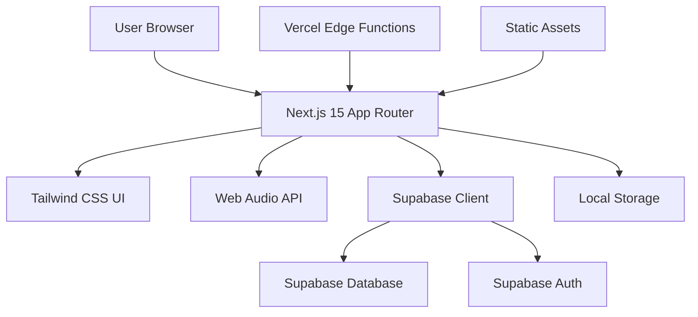

# 設計文書

## 概要

1分瞑想ガイドは、30代ビジネスマン向けの洗練されたWebアプリケーションです。最新の技術スタックを活用し、シンプルで直感的な瞑想体験を提供します。モダンなフロントエンド技術とクラウドベースのバックエンドサービスを組み合わせ、スケーラブルで保守性の高いアーキテクチャを実現します。

## アーキテクチャ

### 高レベルアーキテクチャ



### 技術スタック

**フロントエンド:**
- **Next.js 15** with App Router - 最新のReact Server Components対応
- **React 18** - Concurrent Features活用
- **TypeScript** - 型安全性の確保
- **Tailwind CSS v4** - 最新のCSS-in-JS機能
- **Framer Motion** - 滑らかなアニメーション
- **Web Audio API** - ネイティブ音声処理

**バックエンド & サービス:**
- **Supabase** - データベース、認証、リアルタイム機能
- **Vercel** - ホスティング & エッジファンクション
- **Vercel Analytics** - パフォーマンス監視

**開発 & デプロイ:**
- **ESLint 9** - 最新のFlat Config
- **Prettier** - コード整形
- **Husky** - Git hooks
- **GitHub Actions** - CI/CD

## コンポーネントとインターフェース

### コアコンポーネント

#### 1. 瞑想タイマーコンポーネント
```typescript
interface MeditationTimerProps {
  duration: number; // 秒数
  script: MeditationScript;
  onComplete: () => void;
  onPause: () => void;
  onResume: () => void;
}
```

**機能:**
- 円形プログレスバー（SVG + CSS animations）
- Web Audio API による音声制御
- バックグラウンド実行対応
- キーボードショートカット対応

#### 2. スクリプト選択コンポーネント
```typescript
interface ScriptSelectorProps {
  scripts: MeditationScript[];
  selectedScript: string;
  onScriptChange: (scriptId: string) => void;
}
```

**機能:**
- カード形式のスクリプト表示
- プレビュー機能
- カテゴリフィルタリング

#### 3. 瞑想履歴コンポーネント
```typescript
interface MeditationHistoryProps {
  sessions: MeditationSession[];
  streakCount: number;
  onSessionClick: (session: MeditationSession) => void;
}
```

**機能:**
- カレンダービュー
- 統計表示（連続日数、総時間）
- データエクスポート機能

#### 4. 音声制御コンポーネント
```typescript
interface AudioControllerProps {
  audioUrl: string;
  volume: number;
  onVolumeChange: (volume: number) => void;
  onToggleMute: () => void;
}
```

**機能:**
- Web Audio API統合
- 音量調整
- フェードイン/フェードアウト

### レイアウトコンポーネント

#### 1. アプリレイアウト
- ヘッダー（ナビゲーション、ユーザーメニュー）
- メインコンテンツエリア
- フッター（最小限）

#### 2. 瞑想レイアウト
- 瞑想専用の没入型レイアウト
- 気を散らす要素を排除
- フルスクリーン対応

## データモデル

### 瞑想スクリプト
```typescript
interface MeditationScript {
  id: string;
  title: string;
  description: string;
  category: 'breathing' | 'mindfulness' | 'focus' | 'relaxation';
  duration: number; // 秒数
  audioUrl?: string;
  instructions: MeditationInstruction[];
  tags: string[];
  difficulty: 'beginner' | 'intermediate' | 'advanced';
  createdAt: Date;
  updatedAt: Date;
}

interface MeditationInstruction {
  timestamp: number; // 開始からの秒数
  text: string;
  type: 'guidance' | 'breathing' | 'visualization';
}
```

### 瞑想セッション
```typescript
interface MeditationSession {
  id: string;
  userId?: string; // 匿名ユーザーの場合はnull
  scriptId: string;
  startTime: Date;
  endTime: Date;
  completed: boolean;
  duration: number; // 実際の継続時間（秒）
  rating?: number; // 1-5星評価
  notes?: string;
  deviceInfo: {
    userAgent: string;
    screenSize: string;
  };
}
```

### ユーザープロフィール
```typescript
interface UserProfile {
  id: string;
  email: string;
  displayName?: string;
  preferences: {
    defaultScript: string;
    audioEnabled: boolean;
    volume: number;
    notifications: boolean;
    theme: 'light' | 'dark' | 'auto';
  };
  statistics: {
    totalSessions: number;
    totalDuration: number; // 秒数
    currentStreak: number;
    longestStreak: number;
    favoriteScripts: string[];
  };
  createdAt: Date;
  lastActiveAt: Date;
}
```

### データベーススキーマ (Supabase)

```sql
-- ユーザーテーブル（Supabase Authで管理）
-- 追加のユーザープロフィールデータ
CREATE TABLE user_profiles (
  id UUID REFERENCES auth.users(id) PRIMARY KEY,
  display_name TEXT,
  preferences JSONB DEFAULT '{}',
  statistics JSONB DEFAULT '{}',
  created_at TIMESTAMP WITH TIME ZONE DEFAULT NOW(),
  updated_at TIMESTAMP WITH TIME ZONE DEFAULT NOW()
);

-- 瞑想セッション
CREATE TABLE meditation_sessions (
  id UUID DEFAULT gen_random_uuid() PRIMARY KEY,
  user_id UUID REFERENCES auth.users(id),
  script_id TEXT NOT NULL,
  start_time TIMESTAMP WITH TIME ZONE NOT NULL,
  end_time TIMESTAMP WITH TIME ZONE,
  completed BOOLEAN DEFAULT FALSE,
  duration INTEGER, -- 秒数
  rating INTEGER CHECK (rating >= 1 AND rating <= 5),
  notes TEXT,
  device_info JSONB,
  created_at TIMESTAMP WITH TIME ZONE DEFAULT NOW()
);

-- パフォーマンス向上のためのインデックス
CREATE INDEX idx_meditation_sessions_user_id ON meditation_sessions(user_id);
CREATE INDEX idx_meditation_sessions_start_time ON meditation_sessions(start_time);
CREATE INDEX idx_meditation_sessions_script_id ON meditation_sessions(script_id);
```

## エラーハンドリング

### クライアントサイドエラーハンドリング

1. **音声読み込みエラー**
   - テキストのみのガイダンスへのフォールバック
   - ユーザーフレンドリーなエラーメッセージ
   - リトライ機能

2. **ネットワーク接続**
   - オフラインモード対応
   - ローカルストレージフォールバック
   - プログレッシブエンハンスメント

3. **ブラウザ互換性**
   - Web Audio API機能検出
   - グレースフルデグラデーション
   - 古いブラウザ向けポリフィル

### サーバーサイドエラーハンドリング

1. **Supabase接続エラー**
   - 指数バックオフによるリトライロジック
   - サーキットブレーカーパターン
   - ローカルストレージへのフォールバック

2. **認証エラー**
   - トークンリフレッシュ処理
   - グレースフルログアウト
   - 匿名ユーザーサポート

## テスト戦略

### ユニットテスト
- **フレームワーク:** Vitest + Testing Library
- **カバレッジ:** コンポーネント、ユーティリティ、フック
- **モック:** Supabaseクライアント、Web Audio API

### 統合テスト
- **フレームワーク:** Playwright
- **シナリオ:** ユーザーフロー、認証、データ永続化
- **クロスブラウザ:** Chrome、Firefox、Safari

### E2Eテスト
- **フレームワーク:** Playwright
- **シナリオ:** 完全な瞑想セッション、ユーザー登録
- **パフォーマンス:** Core Web Vitals監視

### アクセシビリティテスト
- **ツール:** axe-core、Lighthouse
- **標準:** WCAG 2.1 AA準拠
- **テスト:** スクリーンリーダー、キーボードナビゲーション

## パフォーマンス最適化

### フロントエンド最適化

1. **コード分割**
   - ルートベース分割
   - コンポーネント遅延読み込み
   - 音声処理の動的インポート

2. **アセット最適化**
   - 画像最適化（Next.js Image）
   - 音声ファイル圧縮
   - フォント最適化

3. **キャッシュ戦略**
   - 静的アセットキャッシュ
   - APIレスポンスキャッシュ
   - Service Worker実装

### バックエンド最適化

1. **データベース最適化**
   - 適切なインデックス作成
   - クエリ最適化
   - コネクションプーリング

2. **CDN利用**
   - 静的アセット配信
   - 音声ファイル配信
   - エッジキャッシュ

## セキュリティ考慮事項

### 認証・認可
- Supabase Row Level Security (RLS)
- JWTトークン検証
- セッション管理
- CSRF保護

### データ保護
- 入力値検証・サニタイゼーション
- SQLインジェクション防止
- XSS保護
- Content Security Policy (CSP)

### プライバシー
- GDPR準拠
- データ最小化
- ユーザー同意管理
- 匿名利用サポート

## デプロイ戦略

### 開発環境
- ローカルSupabaseインスタンス
- ホットリロード
- 開発用アナリティクス

### ステージング環境
- Vercelプレビューデプロイ
- Supabaseステージングプロジェクト
- E2Eテスト自動化

### 本番環境
- Vercel本番デプロイ
- Supabase本番プロジェクト
- 監視・アラート
- 自動バックアップ

### CI/CDパイプライン
```yaml
# GitHub Actions ワークフロー
name: Deploy
on:
  push:
    branches: [main]
jobs:
  test:
    runs-on: ubuntu-latest
    steps:
      - uses: actions/checkout@v4
      - uses: actions/setup-node@v4
      - run: npm ci
      - run: npm run test
      - run: npm run e2e
  
  deploy:
    needs: test
    runs-on: ubuntu-latest
    steps:
      - uses: actions/checkout@v4
      - uses: vercel/action@v1
        with:
          vercel-token: ${{ secrets.VERCEL_TOKEN }}
```

## 監視・アナリティクス

### パフォーマンス監視
- Vercel Analytics
- Core Web Vitals追跡
- エラー追跡（Sentry）
- ユーザーセッション記録

### ビジネスメトリクス
- セッション完了率
- ユーザー継続率
- 機能利用分析
- A/Bテストフレームワーク

### ヘルスチェック
- APIエンドポイント監視
- データベース接続状態
- サードパーティサービス状態
- 自動アラート